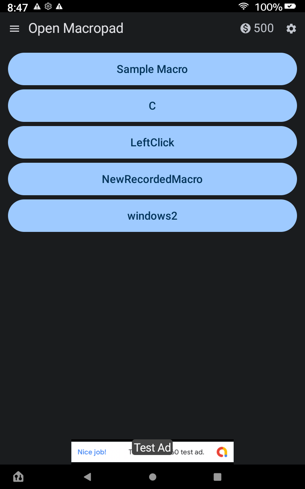
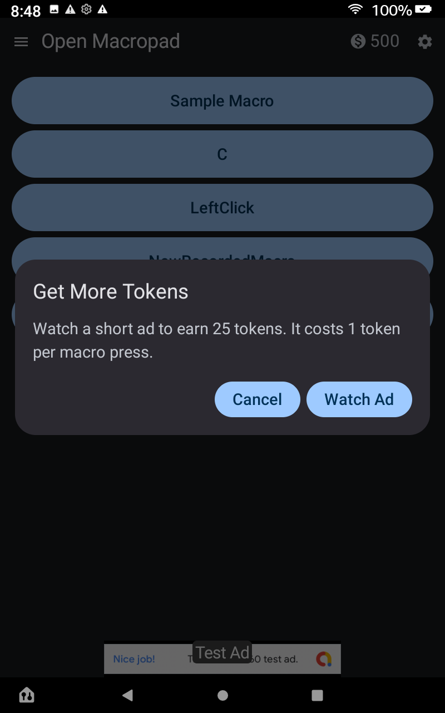

# OpenMacropadKMP

OpenMacropadKMP is a Kotlin Multiplatform project that transforms your Android device into a powerful, remote macropad for your desktop computer. It includes a full-featured desktop server application for creating, managing, and executing powerful automation macros.







## Key Features

### 🖥️ Desktop Server (Compose for Desktop)
*   **Modern UI:** Built entirely with Jetpack Compose for Desktop for a responsive and themable interface.
*   **Advanced Macro Editor:** 
    *   Visual timeline editor for creating complex macros.
    *   Support for **Keyboard Events**, **Mouse Clicks**, **Mouse Movements** (with animation), **Scrolling**, and **Delays**.
    *   JSON-based storage for easy sharing and version control.
*   **Global Hotkeys:** Trigger macros using any keyboard key, even when the application is in the background.
*   **Safety First:** 
    *   **Global Emergency Stop (E-Stop):** Instantly cancel all running macros with a configurable hotkey (default F12).
    *   **Collision Detection:** Prevents multiple macros from running simultaneously to avoid system lockups.
*   **Inspector Tool:** A built-in utility to inspect pixel colors (Hex/ARGB) and mouse coordinates, with optional screenshot capability.
*   **Live Console:** Real-time logs for macro execution, errors, and client connections, with color-coded output.

### 📱 Android Client
*   **Remote Control:** Trigger desktop macros with a single tap.
*   **Freemium Model:** The app is free to use and supported by rewarded ads.
*   **Auto-Discovery:** Automatically finds OpenMacropad servers on your local network.
*   **Secure Connection:** Uses TLS/SSL (WSS) encryption for all communications.

---

## Android Freemium Model

The Android app uses a "token" system to provide a free, ad-supported experience.

*   **How it Works:**
    *   You start with a generous balance of **500 tokens**.
    *   Triggering one macro from your phone costs **1 token**.
*   **Getting More Tokens:**
    *   When you're running low, simply tap your token balance in the top-right corner of the app.
    *   You'll be given the option to watch a short rewarded video ad.
    *   After watching an ad, you'll receive **25 tokens**.

This model allows the app to be free for all users, with heavy users supporting development by watching ads.

---

## Getting Started

### Prerequisites
*   **Native Installers (Recommended):** The provided installers for Windows (`.msi`), macOS (`.dmg`), and Linux (`.deb`) bundle the necessary Java Runtime automatically. **No separate Java installation is required if using these.**
*   **Runnable JAR:** If you prefer to run the standalone JAR file manually, you must have **Java 11 or higher** installed.
    *   **Windows:** [Download Java (Eclipse Temurin)](https://adoptium.net/temurin/releases/?os=windows) - Select "JRE" or "JDK" (version 17 or 21 is recommended).
    *   **Linux:** `sudo apt install openjdk-17-jre` (or similar for your distro).
    *   **macOS:** `brew install openjdk`
*   **Android:** Device running Android 8.0+.

### Desktop Installation

#### Windows
1.  **Option 1 (Installer):** Download and run the `.msi` installer.
2.  **Option 2 (Manual JAR):**
    *   Install Java from the link above.
    *   Download the `.jar` file.
    *   Double-click the `.jar` file, or run via command line:
        ```powershell
        java -jar OpenMacropadServer.jar
        ```

#### Linux
The global hotkey feature requires permission to listen to system-wide input events.

1.  **Grant Permissions:** Before installing, add your user to the `input` group. Open a terminal and run:
    ```bash
    sudo usermod -a -G input $USER
    ```
2.  **Log Out:** You **must log out and log back in** for this change to take effect.
3.  **Install:** Run the provided `.deb` or `.bin` installer.
    *   *Alternatively, run the JAR:* `java -jar OpenMacropadServer-linux-x64-1.0.0-unsigned.jar`

#### macOS
Run the provided `.dmg` installer and drag the application to your Applications folder.

#### General Configuration
*   **Macros:** Macros are saved as `.json` files. The application will prompt you to select a directory on first launch.
*   **Network:** Ensure your firewall allows traffic on the configured port (default 8449 for secure, 8090 for plain).

---

## Architecture

This project follows a clean architecture using **Kotlin Multiplatform**:

*   **`commonMain`**: Shared business logic and UI components (where applicable).
*   **`jvmMain`**: Desktop-specific implementation using:
    *   **Compose for Desktop** for UI.
    *   **JNativeHook** for global keyboard listening.
    *   **Java AWT Robot** for input simulation.
    *   **Ktor** for the WebSocket server.
*   **`androidMain`**: Android client implementation.

### Developer Notes

For detailed technical documentation regarding the challenges faced during development (concurrency, native hooks, Swing/Compose interoperability) and **instructions on how to build the project**, please refer to [DEVELOPMENT_NOTES.md](DEVELOPMENT_NOTES.md).

## License

This project is licensed under the GNU General Public License v3.0. See the [LICENSE](LICENSE) file for details.
