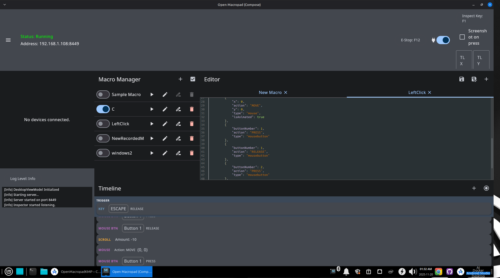
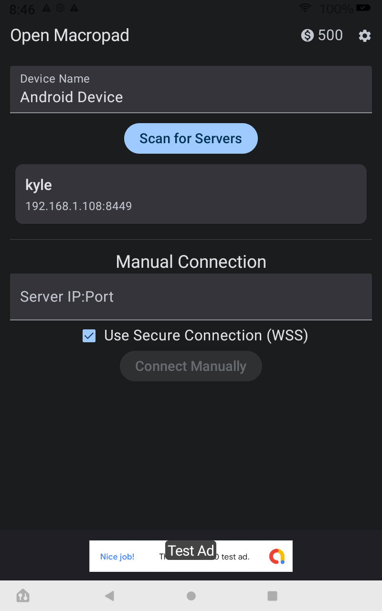
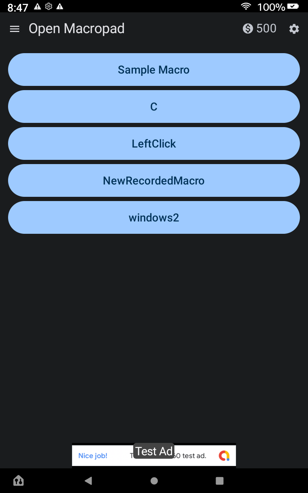
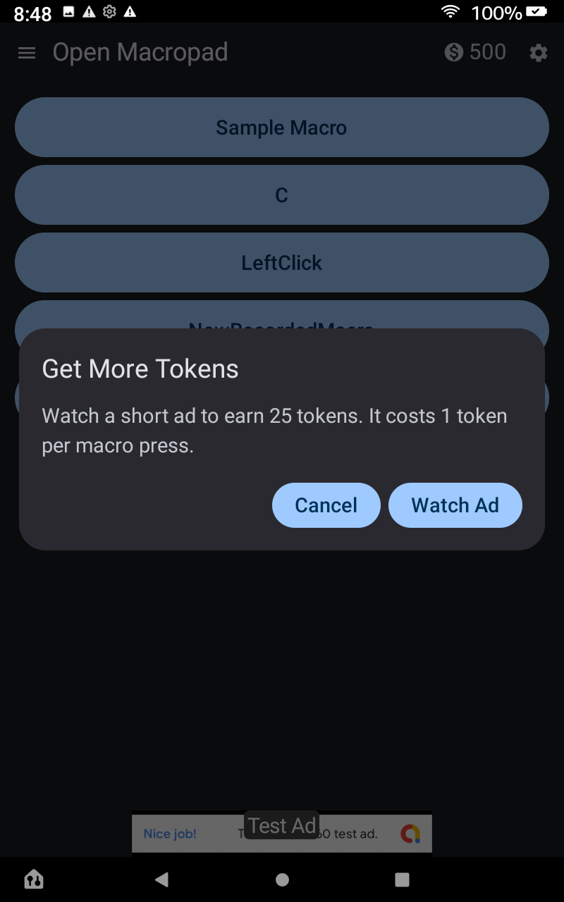

# OpenMacropadKMP

OpenMacropadKMP is a Kotlin Multiplatform project that transforms your Android device into a powerful, remote macropad for your desktop computer. It includes a full-featured desktop server application for creating, managing, and executing powerful automation macros.

> **Development Note**: This project uses a `main` branch for stable releases and a `dev` branch for active development. Please ensure you are on the `dev` branch for the latest features and updates.







## Features

### Desktop Server
*   **Macro Editor:** A visual timeline editor for creating macros with a dedicated `MacroTimelineViewModel`.
*   **Architectural Excellence:** Refactored into a robust, package-organized structure (UI, ViewModels, Logic, Models, DI) for maximum maintainability.
*   **Centralized DI:** Uses a `ViewModelFactory` to manage ViewModel lifecycles and complex dependencies.
*   **Event Types:** Support for keyboard events, mouse clicks, cursor movements, scrolling, and delays.
*   **Global Hotkeys:** Trigger macros using physical keyboard keys while the application is in the background.
*   **System Tray Integration**: Run the server in the background with a state-aware tray icon, context menu, and "Minimize to Tray" support.
*   **Security & Device Management**: Features a Physical Consent Pairing system with 6-digit verification codes and **QR Code scanning** for seamless setup. Includes persistent whitelisting/banning, **native OS keyring integration** (via `SecretManager`) for identity protection, hardware-backed keystore management on Android, "Device Discovery" control, and an "Ask Every Time (One-Time Approvals ONLY)" mode for maximum security.
*   **Sync (Fleet) Mode**: A high-reliability pairing system designed for mass-provisioning devices. Features a **Smart Multi-QR Grid** that automatically calculates optimal row/column density based on window size and visibility toggles to prevent UI overlap. Includes a **Spatial Grid Selector** to persistently enable/disable specific grid positions (Corners and Centers).
*   **Lifecycle Management**: Support for in-app application restarts (via `ProcessBuilder`) and a standardized `ExitConfirmDialog` for graceful shutdowns.
*   **Slam Fire Hardware Triggers**: Utilize the device's **Proximity Sensor** as a hands-free, high-speed physical trigger.
    *   **Single Slam**: Execute a primary macro or "OK" action.
    *   **Double Slam**: Execute a secondary macro or "Cancel/Back" action with configurable timing thresholds.
    *   **Context Aware**: Automatically acts as a QR scanner toggle during setup, then transitions to macro triggering once connected.
*   **Animation & Polish**: Smooth window transitions to the tray, high-quality 512px taskbar icons, and Material 3 dialog notifications.
*   **Safety Mechanisms**: Includes a configurable emergency stop (E-Stop) and collision detection to prevent multiple macros from running at once.
*   **Inspector:** Utility to identify screen coordinates and pixel colors.
*   **Console:** Real-time logging of macro execution and client connections. Includes **Auto-scroll** toggle, **Timestamps**, and an optional **Log to File** mode for deep debugging.

### Android Client
*   **Remote Triggering:** Interface to execute desktop macros from a mobile device with real-time execution feedback (progress bars and status).
*   **Token System:** A rewarded ad-supported model for macro execution.
*   **Discovery:** Automatic discovery of servers on the local network.
*   **Security:** Supports TLS/SSL (WSS) for encrypted communication and out-of-band TOFU verification.

## Installation and Usage

### Prerequisites
*   **JDK 17 or higher:** Required to build and run from source.
*   **Android 8.0+**: Required for the mobile client.

### Building from Source

#### Desktop
1. Ensure `JAVA_HOME` is set to your JDK installation.
2. Run the application using the Gradle wrapper:
   ```bash
   ./gradlew :composeApp:run
   ```

#### Android
1. Open the project in Android Studio.
2. Build and deploy the `composeApp` module to your device.

### Linux Setup
To use global hotkeys on Linux, the user must be part of the `input` group:
1. Run: `sudo usermod -a -G input $USER`
2. Log out and log back in for the change to take effect.

## Architecture

This project uses Kotlin Multiplatform (KMP) to share code between platforms:
*   **commonMain**: Shared business logic, models, and UI themes.
*   **jvmMain**: Desktop server implementation using Compose for Desktop, Ktor 3.x, JNativeHook, and Java AWT Robot. Organized into a clean, multi-layered package structure (`ui`, `viewmodel`, `model`, `logic`, `di`).
*   **androidMain**: Android client implementation using standard Android components and AdMob.

## Developer Documentation
For detailed technical notes on the implementation, including the migration from Ktor 2 to Ktor 3, refer to [DEVELOPMENT_NOTES.md](DEVELOPMENT_NOTES.md). For a guide on the codebase structure, see [CODE_MAP.md](CODE_MAP.md).

## License
This project is licensed under the GNU General Public License v3.0. See the [LICENSE](LICENSE) file for details.
