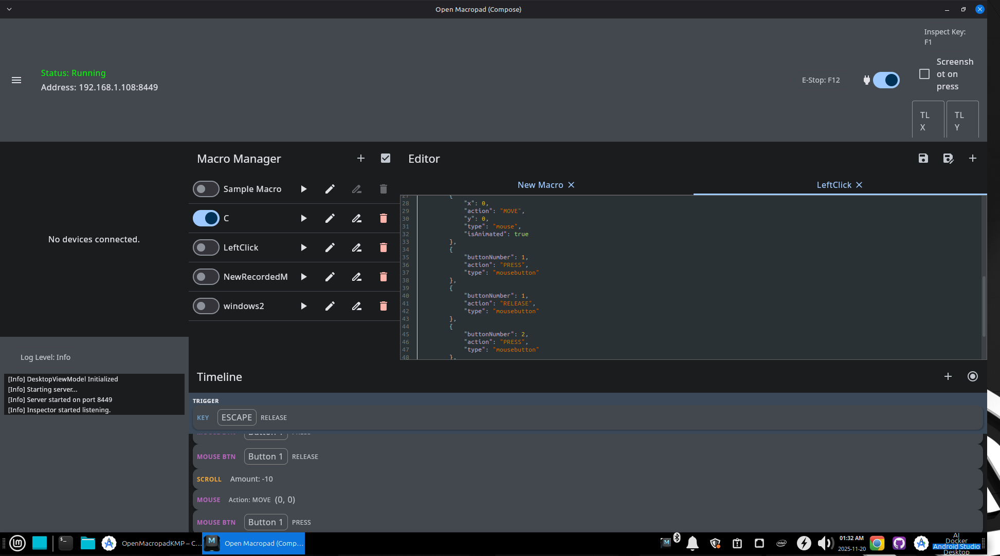
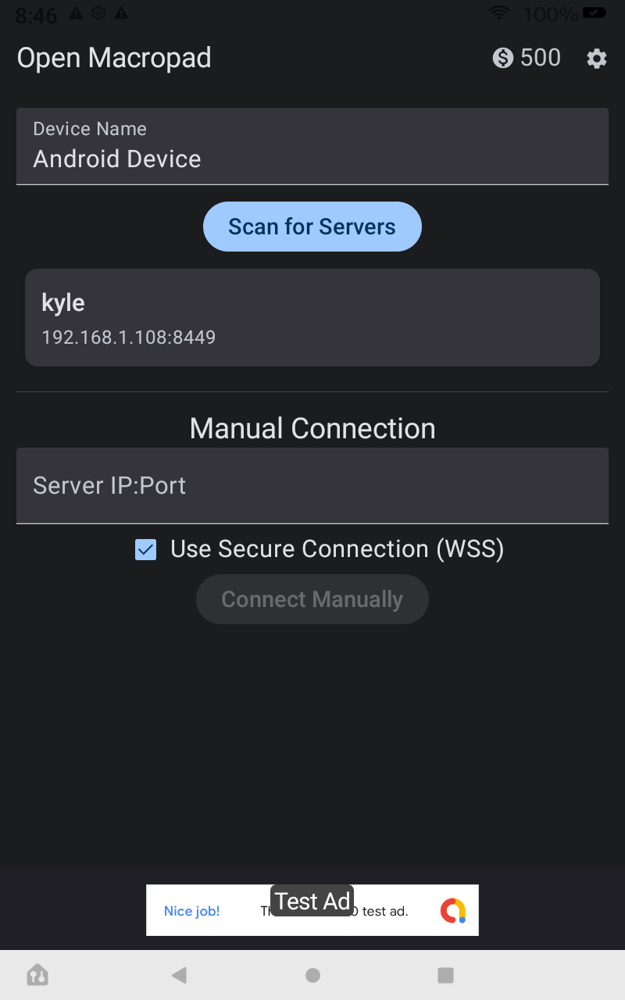
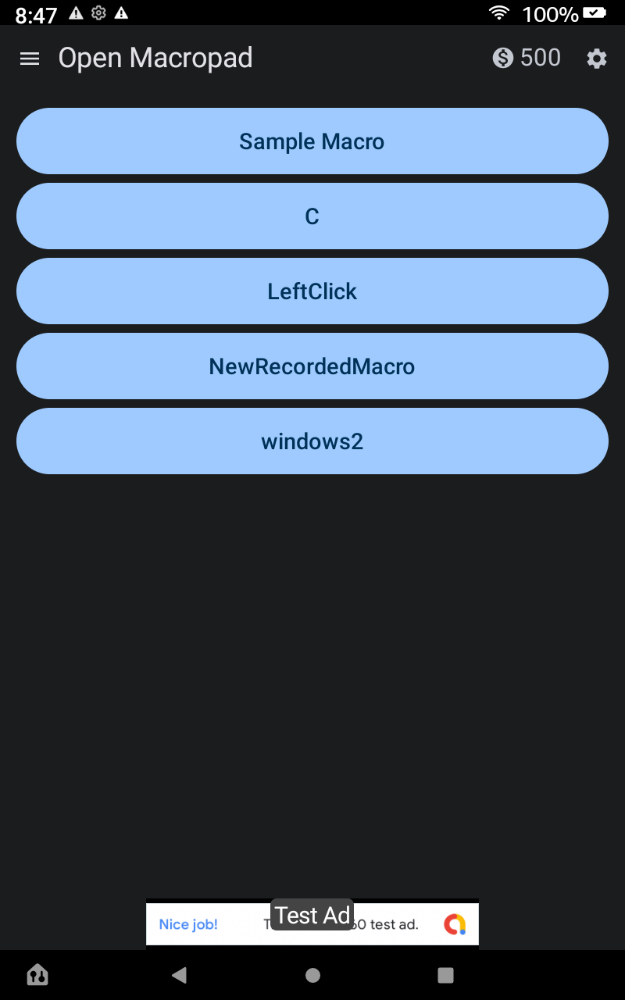
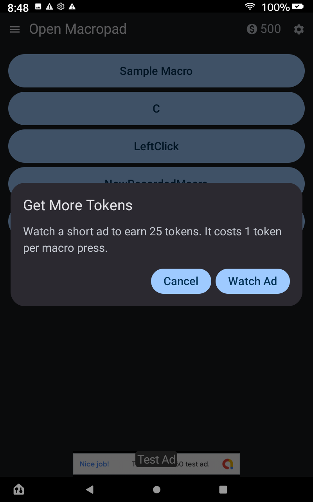

# MacroKapKMP

MacroKapKMP is a Kotlin Multiplatform project that transforms your Android device into a powerful, remote macropad for your desktop computer. It includes a full-featured desktop server application for creating, managing, and executing powerful automation macros.

> **Development Note**: This project uses a `main` branch for stable releases and a `dev` branch for active development. Please ensure you are on the `dev` branch for the latest features and updates.







## Features

### Desktop Server
*   **Macro Editor:** A visual timeline editor for creating macros with a dedicated `MacroTimelineViewModel`.
*   **Architectural Excellence:** Clean, multi-layered package structure (UI, ViewModels, Logic, Models, DI) for maximum maintainability.
*   **Centralized DI:** Uses a `ViewModelFactory` to manage ViewModel lifecycles and complex dependencies.
*   **Event Types:** Support for keyboard events, mouse clicks, cursor movements, scrolling, and delays.
*   **Global Hotkeys:** Trigger macros using physical keyboard keys while the application is in the background via **JNativeHook**.
*   **System Tray Integration**: Run the server in the background with a state-aware tray icon, context menu, and a flexible three-option exit system (**Ask, Exit to Tray, Just Exit**).
*   **Security & Device Management**: Features a Physical Consent Pairing system with 6-digit verification codes and **QR Code scanning**. Includes persistent whitelisting/banning, **native OS keyring integration** (via `SecretManager`) for identity protection, "Device Discovery" control, and an "Ask Every Time" mode.
*   **Sync (Fleet) Mode**: A high-reliability pairing system designed for mass-provisioning devices with a **Smart Multi-QR Grid**.
*   **Gold Standard Currency**: A unified monetization system across Desktop and Android. All currency-related elements use high-contrast Gold (`#FFFFD700`).
*   **Split Pane Console**: Redesigned Desktop sidebar with a `MoveableVerticalSplitPane` and custom-styled **Pill-Shaped Pulltabs**, dividing "Current Sessions" and "Recent Activity".
*   **Lifecycle Management**: Support for in-app application restarts and a standardized **three-way Exit Dialog**.
*   **Advanced Automation Engine**: A professional-grade stateful automation suite integrated with **GraalVM** for high-performance JavaScript scripting.
    *   **Logic-Driven Routines**: Create "If/Then" logic based on system variables.
    *   **Multi-Trigger Stacks**: Assign multiple independent triggers (Hotkeys, sequences, or state changes) to a single routine.
    *   **Live Variable Inspector**: Real-time sidebar dashboard for monitoring mouse coordinates, pixel colors, window titles, and system clipboard state.
*   **Integrated Gamepad Support**: Utilize game controllers as macro triggers via **Jamepad**.

### Android Client
*   **Rich Widget Support:** Execute desktop macros from a mobile device with real-time feedback. Supports **Buttons**, **Toggles**, and **Sliders**.
*   **Dual-Mode Interface**: Features **Active Pack** (context-aware grid based on focused desktop app) and **My Dashboard** (user-curated favorite macros).
*   **Editable Dashboard:** Fully customizable grid with **Drag-and-Drop Reordering** and **Drag-to-Trash** deletion.
*   **Slam Fire Hardware Triggers**: Utilize the device's **Proximity Sensor** as a hands-free, high-speed physical trigger (Single/Double Slam).
*   **Discovery**: Automatic discovery of servers on the local network via UDP.
*   **Google Play Billing**: Support for Pro and Ad-Free tiers via In-App Purchases and Subscriptions.
*   **Kap System**: A rewarded ad-supported model for macro execution with a 10-second **Grace Period** and high-visibility timer bar.
*   **Dynamic UI Animations**: Coordinate-aware animations for flying Kaps and reward effects.
*   **Security:** Supports TLS/SSL (WSS) with **Certificate Pinning** and stable hardware fingerprints.

## Installation and Usage

### Prerequisites
*   **JDK 17 or higher:** Required to build and run from source.
*   **Android 8.0+**: Required for the mobile client.

### Building from Source

#### Desktop
```bash
./gradlew :composeApp:run
```

#### Android
1. Open the project in Android Studio.
2. Build and deploy the `composeApp` module.
3. **Performance Tip**: Use the `release` build or a variant with R8 enabled (like `debugR8` if configured) for significantly faster startup times.

### Linux Setup
To use global hotkeys on Linux:
1. Run: `sudo usermod -a -G input $USER`
2. Log out and log back in.

## Architecture

This project uses Kotlin Multiplatform (KMP):
*   **commonMain**: Shared business logic, models, network protocols, and UI themes.
*   **jvmMain**: Desktop server implementation using Compose for Desktop, Ktor 3.x, JNativeHook, and Jamepad.
*   **androidMain**: Android client implementation using Jetpack Compose, CameraX, and Google Play Billing.

## Help & Feedback

*   **Open an Issue:** Report bugs via the [GitHub Issues](https://github.com/kapcode/MacroKapKMPKMP/issues) tracker.
*   **Security Concerns:** Refer to [SECURITY.md](SECURITY.md).
*   **Technical Navigation:** See [CODE_MAP.md](CODE_MAP.md) and [AGENTS.md](AGENTS.md).

## License
This project is licensed under the GNU General Public License v3.0. See the [LICENSE](LICENSE) file for details.
